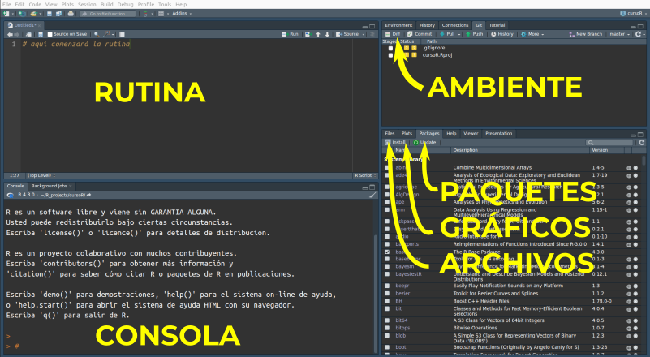

```{r setup, include=FALSE}
knitr::opts_chunk$set(echo = TRUE)
```

## R
R es un lenguaje utilizado para análisis estadísticos, gráficos y programación. Puede ser copiado y distribuido de forma gratuita y permite que los usuarios estudien como funciona, lo modifiquen de acuerdo a sus necesidades y publiquen sus mejoras y extensiones para ser compartidas con otros usuarios.   

R es actualmente el software que ofrece mayor número de funciones estadísticas y aplicaciones para la creación de gráficos. Colaboradores de todo el mundo producen paquetes destinados a resolver problemas particulares o desarrollan determinadas técnicas estadísticas. Cada usuario puede, además, crear sus propias funciones y rutinas combinando las funciones existentes.  

Existe una amplia comunidad de usuarios y por lo tanto, una gran oferta de ayudas para aquellos que se inician en el uso del programa, incluyendo foros de discusión en internet, grupos de usuarios y una profusa bibliografía.   

Para quienes trabajamos en ciencias, R es una *lingua franca* para el intercambio y la difusión de ideas. De la misma manera en que se escribe un artículo para comunicar ideas, pueden escribirse rutinas para comunicar un análisis. Como lenguaje, R asegura la reproduciblidad de los análisis: un registro completo de los procedimientos que se siguieron, permitiendo repetir los análisis después.

Para finalizar, y tal vez lo más importante, el aprendizaje de R tiene un gran componente lúdico, fomenta la capacidad de análisis y la creatividad.   


## ¿Qué es una rutina, qué es un código?

Las rutinas de una investigación científica pueden ser separadas en dos grandes categorías ([Mislan *et al.* 2016](https://www.sciencedirect.com/science/article/pii/S0169534715002906)).   

1. Las rutinas de análisis (*analysis code*) se utilizan para ensamblar bases de datos y corregir errores, simular el resultado de modelos, realizar análisis estadísticos y crear figuras. Poner a disposición libre las rutinas de análisis permite que los resultados de un estudio puedan ser reproducidos.   
2. El software científico (como puede ser un paquete de R o Python) es diseñado para tener múltiples usos. Puede ser el producto mismo de una investigación.   

## Sobre las rutinas de este curso

En este curso las rutinas aparecen incrustadas en la página web y pueden reconocerse por su distinta tipografía y por estar en recuadros. Por comodidad utilizaremos [RStudio](https://www.rstudio.com/) como *interfaz gráfica de usuario* (GUI) para ejecutar la rutinas, pero resaltando siempre su naturaleza de lenguaje, independiente del soporte donde es ejecutado. A partir de 2015 todo el material de este curso está disponibles en forma abierta en el repo https://github.com/santiagombv/cursoR y en la página http://santiagombv.github.io/cursoR/.     

## Sobre este curso   

Este curso está orientado al análisis de datos biológicos, particularmente en el ámbito de la ecología y evolución. Por lo tanto, no se dedicará demasiado tiempo a la manipulación y preparación de datos. El objetivo de este curso es brindar las capacidades para realizar una rutina de análisis estadístico, aplicando conocimientos de modelos lineales, manejos de gráficos y programación.   
El contenido teórico de este curso comprende introducción al aprendizaje estadístico supervisado, modelos lineales generales, selección de modelos y regularización, y métodos de remuestreo  (bootstrap y permutaciones). También aborda la construccíon de gráficos a través de los paquetes *graphics*, *lattice* y, fundamentalmente, *ggplot2* y la construcción de funciones.   

--- 

## Instalación de R y de sus paquetes en Windows

### Instalación de R

Ingresar a http://cran.r-project.org/   
En download R for Windows - base, seleccionar la última versión disponible de R (4.3.0 "Already Tomorrow" al momento de actualizar este curso). Guardar el archivo R-4.3.0-win.exe en cualquier parte de la computadora, ejecutarlo y seguir las instrucciones de instalación. 

### Instalación de RStudio

Descargar la última version de RStudio Desktop para el sistema operativo deseado (version gratuita) desde https://posit.co/download/rstudio-desktop/ y seguir las instrucciones de instalación.  

Aquí mostramos cómo se ve RStudio con una rutina abierta.   




### Instalación de paquetes

Los paquetes de R son colecciones de funciones para un fin determinado, asociadas a su ayuda, un manual de referencia y, frecuentemente, a bases de datos y demostraciones de uso (llamadas *vignettes*).   

En R-base seleccionar Paquetes - Instalar Paquetes (la computadora debe estar conectada a internet). Alternativamente, en R Studio seleccionar install en la pestaña packages.  
Seleccionar el espejo CRAN desde donde se bajará el paquete.  
Seleccionar un paquete de la lista desplegable. 

En ambos casos, puede hacerse mediante instrucciones en la consola:  

```R
install.packages("nombre_del_paquete")
```

Los paquetes mismos deben actualizarse regularmente, particualrmente junto a los cambios en las versiones de R (recomiendo hacerlo al menos dos veces al año). Para esto, ejecute y posteriormente siga las instrucciones.

```R
update.packages()
```

> Para este curso, se requieren los siguientes paquetes que no son descargados de forma automática con la instalación de R, por lo que deberá instalarlos manualmente: *arm*, *car*, *devtools*, *glmnet*, *GGally*, *ggplot2*, *lattice*, *leaps*, *magrittr*, *MuMIn*, *patchwork*, *rgl*, *rmarkdown*, *sciplot*, *viridis* y todas las dependencias necesarias.  


### Actualización de R. 
La manera más práctica es el paquete *installr* y ejecutando

```R
install.packages("installr")
library(installr)
updateR() #seguir las instrucciones que aparezcan
```

### Actualización de RStudio. 
Dirigirse a `Help - check for updates`.   

--- 

## Instalación de R y de sus paquetes en Ubuntu

### Instalación de R

Añadir una fuentes de software desde "Software y actualizaciones" - "Otro Software". Seleccionar "Añadir". En la ventana que solicita la línea de APT completa del repositorio colocar:   
```
deb https://cloud.r-project.org/bin/linux/ubuntu jammy-cran40/
```
En esta línea puede cambiar el espejo CRAN elegido por alguno de los listados en  http://cran.r-project.org/ Por ejemplo http://cran.rstudio.com/bin/linux/ubuntu/  corresponde al espejo propio de RStudio. Puede cambiar también la distribución de Ubuntu empleada (jammy, focal, bionic, etc. indicada antes del -cran40). 

Agregar una clave de seguridad al sistema (en caso de que esta opción "no funcione", ver otras posibilidades en http://cran.r-project.org/). En la terminal ingresar:   

```
sudo apt-key adv --keyserver keyserver.ubuntu.com --recv-keys E298A3A825C0D65DFD57CBB651716619E084DAB9
```

Instalar R desde terminal.     

```
sudo apt-get update
sudo apt-get install r-base
```

### Instalación de RStudio

Descargar la última version de RStudio Desktop (version gratuita) desde https://posit.co/download/rstudio-desktop/ y seguir las instrucciones de instalación.    

Aquí mostramos cómo se ve RStudio con una rutina abierta.   


### Instalación de paquetes

Los paquetes de R son colecciones de funciones para un fin determinado, asociadas a su ayuda y, frecuentemente, a bases de datos y demostraciones de uso (*vignettes*).   

La manera más práctica en Ubuntu es desde terminal.

```
sudo R
install.packages("nombre_del_paquete")
```

> Para este curso, se requieren los siguientes paquetes que no son descargados de forma automática con la instalación de R, por lo que deberá instalarlos manualmente: *arm*, *car*, *devtools*, *glmnet*, *GGally*, *ggplot2*, *lattice*, *leaps*, *magrittr*, *MuMIn*, *patchwork*, *rgl*, *rmarkdown*, *sciplot*, *viridis* y todas las dependencias necesarias.  

Los paquetes mismos deben actualizarse regularmente, particualrmente junto a los cambios en las versiones de R. Para esto, ejecute y posteriormente siga las instrucciones.

```R
update.packages()
```

### Actualización de R

Al agregar una fuente de software a la computadora, R se actualizará junto a todos los otros programas, automáticamente.   

> Se recomienda fuertemente seguir este curso con una *versión actualizada de R y RStudio*. En caso de tener problemas con la actualización, desinstalar todas las versiones anteriores.

